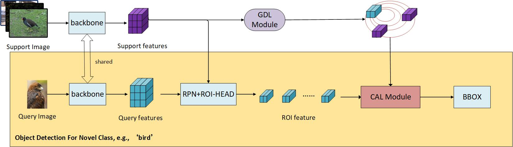

## FSAD



> **FSAD:Few-Shot Object Detection via Aggregation and Disentanglement**

Our code is based on [mmfewshot](https://github.com/open-mmlab/mmfewshot).

### Setup

* **Installation**

Here is a from-scratch setup script.

```bash
conda create -n model python=3.8 -y
conda activate model

conda install pytorch==1.7.1 torchvision==0.8.2 cudatoolkit=11.0 -c pytorch

pip install openmim
mim install mmcv-full==1.3.12

# install mmclassification mmdetection
mim install mmcls==0.15.0
mim install mmdet==2.16.0

# install mmfewshot
mim install mmfewshot==0.1.0

# install FSAD
python setup.py develop

```

* **Prepare Datasets**

Please refer to mmfewshot's [detection data preparation](https://github.com/open-mmlab/mmfewshot/blob/main/tools/data/README.md).


### Train and Test

* **Testing**

```bash
# single-gpu test
python test.py ${CONFIG} ${CHECKPOINT} --eval mAP|bbox

# multi-gpus test
bash dist_test.sh ${CONFIG} ${CHECKPOINT} ${NUM_GPU} --eval mAP|bbox
```

For example:
* test FSAD on VOC split1 1-shot with sinel-gpu, we should run:
```bash
python test.py configs/fsad/voc/split1/fsad_r101_c4_8xb4_voc-split1_1shot-fine-tuning.py \
work_dirs/fsad_r101_c4_8xb4_voc-split1_1shot-fine-tuning/iter_400.pth \
--eval mAP
```

* test FSAD on COCO 10-shot with 8 gpus, we should run:
```bash
bash dist_test.sh configs/fsad/coco/fsad_r101_c4_8xb4_coco_10shot-fine-tuning.py \
work_dirs/fsad_r101_c4_8xb4_coco_10shot-fine-tuning/iter_10000.pth \
8 --eval bbox
```

* **Training**

```bash
# single-gpu training
python train.py ${CONFIG}

# multi-gpus training
bash dist_train.sh ${CONFIG} ${NUM_GPU}
```

For example: train FSAD on VOC.
```bash
# Stage I: base training.
bash dist_train.sh configs/fsad/voc/split1/fsad_r101_c4_8xb4_voc-split{1,2,3}_base-training.py 8

# Stage II: few-shot fine-tuning on all splits and shots.
voc_config_dir=configs/fsad/voc/
for split in 1 2 3; do
    for shot in 1 2 3 5 10; do
        config_path=${voc_config_dir}/split${split}/fsad_r101_c4_8xb4_voc-split${split}_${shot}shot-fine-tuning.py
        echo $config_path
        bash dist_train.sh $config_path 8
    done
done
```

**Note**: All our configs and models are trained with 1 gpu. You need to change the learning rate or batch size if you use fewer/more gpus.


